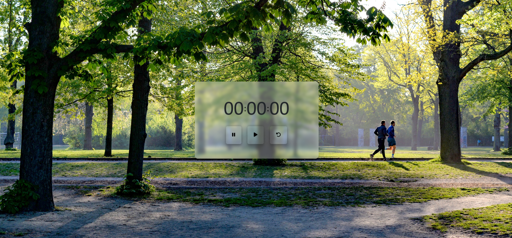

# Stop Watch ⌚
I created a simple yet functional stopwatch using HTML, CSS, and JavaScript. This stopwatch features start, stop, and reset functionality, making it easy to track time efficiently. It's fully responsive and adapts seamlessly to any device, ensuring a smooth user experience across different screen sizes.

## Demo 📸

## Features 🚀

- HTML : html to create structure.
- CSS : using css to style the webpage. like font color and sizes and button background color and icon color and padding.
- JAVASCRIPT : using javascript to create functionality.

## What i learn in this project 📝

- DOM: how to access elements in html and change element value using javascript DOM.
- setInterval and clearInterval : how to work with setInterval and clearInterval functionality.
- Destructure: how to destructure array in javascript.
- Ternary operator: how to use ternary operator in javascript.
